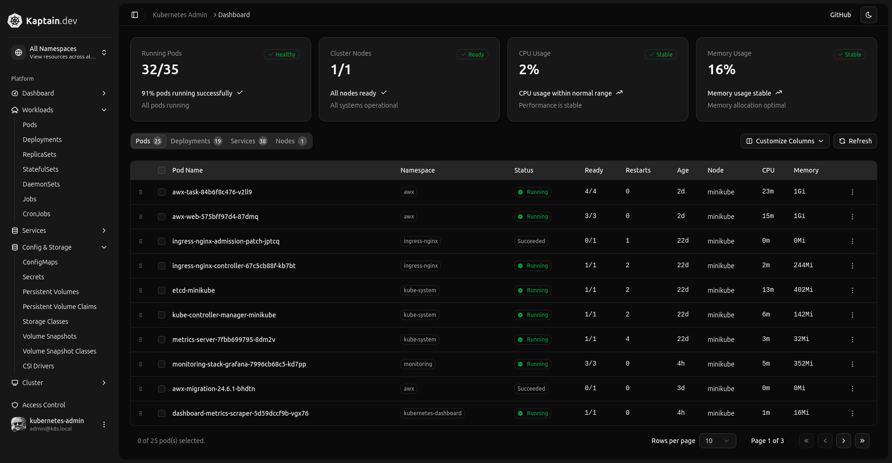
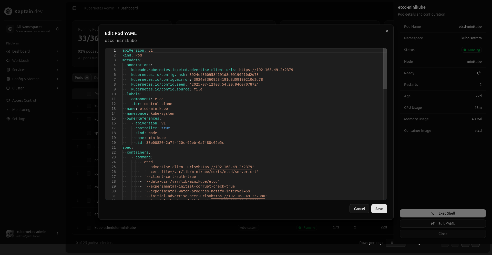

# Kaptain

[](https://goreportcard.com/report/github.com/aaronlmathis/k8s-admin-dash/internal)
[](https://opensource.org/licenses/MIT)

A secure, production-ready **Kubernetes admin dashboard** that can observe cluster state and perform safe operational actions. Built with Go backend (client-go + WebSockets) and Astro + React + Shadcn frontend (TypeScript + Tailwind CSS).

## Features

- **Real-time cluster monitoring** - Live updates via WebSockets
- **Safe node operations** - Cordon, uncordon, and drain with safeguards
- **Declarative deployments** - Server-side apply with dry-run support
- **Modern UI** - React + TypeScript + Tailwind CSS + ShadCN with dark mode
- **Security-first** - RBAC integration, audit logs, rate limiting
- **Easy deployment** - Helm chart for in-cluster deployment
- **Multiple modes** - Container deployment or desktop app (Wails2)

**Current Dashboard**



**Edit YAML / Pod Details**



**Cloud Shell Exec**


---

## Quick Start

### Prerequisites

- Go 1.22+
- Node.js 20+
- Docker (optional)
- Kind (for local development)

### Local Development

1. **Clone and setup**:
   ```bash
   git clone https://github.com/aaronlmathis/kaptn.git
   cd kaptn
   make install-deps
   ```

2. **Start a Kind cluster**:
   Launch a simple kubernetes cluster for local development:
   ```bash
   make kind-up
   ```
   Or, minikube works as wel...

3. **Run the application**:
   ```bash
   make build
   ./bin/server         # Build frontend and backend server.
   
   # Launch server. Web portal and API default to :8080
   ./bin/server
   
   # Available command line options:
   ./bin/server --version           # Show version information
   ./bin/server --health-check      # Perform health check
   ./bin/server --config config.yaml # Use specific config file
   ```

4. **Access the dashboard**:
   - http://localhost:8080/


### Build and Deploy

1. **Build everything**:
   ```bash
   make build
   ```

2. **Build Docker image**:
   ```bash
   make docker
   ```

3. **Deploy to Kubernetes** (coming soon):
   ```bash
   helm install kad ./deploy/helm -n kube-system
   ```

---

## Project Structure

```
├── cmd/server/           # Main application entry point
├── internal/             # Private Go packages
│   ├── api/             # HTTP handlers and routing
│   ├── k8s/             # Kubernetes client and operations
│   ├── config/          # Configuration management
│   ├── logging/         # Structured logging
│   └── version/         # Version information
├── frontend/                 # React frontend application
│   ├── src/
│   │   ├── components/  # React components
│   │   └── ...
├── deploy/              # Deployment manifests
│   ├── helm/           # Helm chart
│   └── rbac/           # RBAC examples
├── .github/workflows/   # CI/CD pipelines
└── docs/               # Documentation
```

---

## Configuration

The application can be configured via environment variables or a config file:

```yaml
# config.yaml
server:
  addr: "0.0.0.0:8080"
  base_path: "/"
  cors:
    allow_origins: ["*"]
    allow_methods: ["GET", "POST", "PUT", "DELETE", "OPTIONS"]

security:
  # enable one of: "none", "header", "oidc"
  auth_mode: "none"
  oidc:
    issuer: ""
    client_id: ""
    audience: ""
    jwks_url: ""

kubernetes:
  mode: "kubeconfig"        # or "incluster"
  kubeconfig_path: ""       # used if mode=kubeconfig, defaults to $KUBECONFIG
  namespace_default: "default"

features:
  enable_apply: true
  enable_nodes_actions: true
  enable_overview: true
  enable_prometheus_analytics: true

rate_limits:
  apply_per_minute: 10
  actions_per_minute: 20

logging:
  level: "info"             # debug, info, warn, error

integrations:
  prometheus:
    url: "http://prometheus.monitoring.svc:9090"
    timeout: "5s"
    enabled: true

caching:
  overview_ttl: "2s"
  analytics_ttl: "60s"

jobs:
  persistence_enabled: true
  store_path: "./data/jobs"
  cleanup_interval: "1h"
  max_age: "24h"
```
```
Key environment variables:
- `PORT` - Server port (default: 8080)
- `LOG_LEVEL` - Logging level (debug, info, warn, error)
- `KUBECONFIG` - Path to kubeconfig file
- `KAD_CONFIG_PATH` - Path to config file
```

---

# Kaptn Administrative Feature Roadmap

## Cluster Overview & Management
- View real-time cluster health and resource utilization (CPU, memory, disk, network)
- Display node status, conditions, and capacity usage
- Show aggregated namespace summaries (resource quotas, usage, limits)
- Cluster-wide event stream with filtering by type, namespace, or keyword
- View and manage Kubernetes API server, scheduler, and controller-manager status
- View all API resources, CRDs, and versions

## Namespace & Resource Scoping
- Switch between namespaces quickly
- Create, edit, and delete namespaces
- Apply resource quotas and limit ranges per namespace
- Manage namespace labels and annotations

## Workload Management
- List, describe, and filter Deployments, StatefulSets, DaemonSets, and ReplicaSets
- Scale workloads (manual replica count adjustment)
- Restart workloads (rolling restart)
- Trigger image updates or rollbacks
- View rollout history and undo to previous versions
- Pause and resume rollouts
- Manage workload labels and annotations

## Pod Management
- View pod details (status, events, IP, node placement, resource requests/limits)
- Stream logs from one or multiple containers
- Execute shell commands inside running containers (interactive exec)
- Copy files to/from containers
- Delete pods (to trigger redeployment)
- Drain or cordon nodes hosting problematic pods
- Edit pod YAML for transient debugging changes

## Service & Networking Management
- List and describe Services, Endpoints, and EndpointSlices
- Create, edit, and delete Services (ClusterIP, NodePort, LoadBalancer)
- Restart selected services or force re-provisioning
- Manage Ingress objects (NGINX, Istio, etc.)
- View and edit ConfigMaps and Secrets (with RBAC-based redaction)
- View and modify NetworkPolicies
- Port-forward services to local machine
- Test service reachability from within the cluster

## Storage Management
- List and describe PersistentVolumeClaims and PersistentVolumes
- Edit PVCs and rebind to different PVs
- View storage class details and provisioner status
- Delete or resize PVCs (if supported by provisioner)
- Create and manage snapshots of PVCs
- Mount and inspect volume contents (read-only access)

## Job & CronJob Management
- List running and completed Jobs
- View Job logs and failure reasons
- Restart failed Jobs
- Edit CronJob schedules and definitions
- Suspend or resume CronJobs
- Manually trigger a CronJob run

## Config & Secret Management
- View, create, edit, and delete ConfigMaps
- View, create, edit, and delete Secrets (with sensitive value masking)
- Apply changes immediately to dependent workloads
- Compare live vs stored versions of configurations
- Version history and rollback for configurations

## Security & RBAC Management
- View all ServiceAccounts, Roles, RoleBindings, ClusterRoles, and ClusterRoleBindings
- Create and edit RBAC bindings
- Impersonate a ServiceAccount for troubleshooting
- Audit who has access to what resources
- Detect overly permissive RBAC rules

## System Maintenance & Troubleshooting
- View and edit raw YAML for any editable resource
- Apply YAML changes directly from the dashboard
- Restart core components (kube-proxy, CNI, DNS, ingress controllers)
- View logs for system pods in kube-system and other critical namespaces
- Node management: drain, cordon, uncordon, taint, and label nodes
- Trigger garbage collection for unused images and volumes
- Restart selected namespaces or components in bulk

## Observability Integration
- Integrated metrics from Prometheus (pod, node, cluster)
- View container CPU, memory, disk, and network trends
- View historical data for troubleshooting performance issues
- Log aggregation and search across namespaces
- Correlate events, logs, and metrics for incidents

## Backup & Restore
- Trigger ad-hoc backups of resources or namespaces
- Restore from previous backups
- Export full cluster YAML for disaster recovery
- Export filtered sets of resources for migration

## Advanced Automation
- Save custom kubectl queries for re-use
- Define and run preconfigured automation scripts/jobs
- Trigger webhooks or automation pipelines based on events
- Schedule recurring administrative tasks

## Audit & Activity Tracking
- View recent administrative actions taken via Kaptn
- Search audit history by user, namespace, resource, or action
- Export audit logs for compliance
- Detect anomalies in administrative activity

---

## Development

### Make Targets

```bash
make help           # Show all available targets
make dev            # Run in development mode
make build          # Build binary and frontend
make test           # Run all tests
make lint           # Lint code
make fmt            # Format code
make clean          # Clean build artifacts
make kind-up        # Create Kind cluster
make kind-down      # Delete Kind cluster
make docker          # Without shell
make docker-debug    # build docker image with shell
make push            # Push image to registry
make push-debug      # Push debug image to registry
```

## License

This project is licensed under the MIT License - see the [LICENSE](LICENSE) file for details.

## Acknowledgments

- [Kubernetes](https://kubernetes.io/) - The platform this dashboard manages
- [client-go](https://github.com/kubernetes/client-go) - Official Kubernetes Go client
- [Vite](https://vitejs.dev/) - Fast frontend build tool
- [Tailwind CSS](https://tailwindcss.com/) - Utility-first CSS framework
