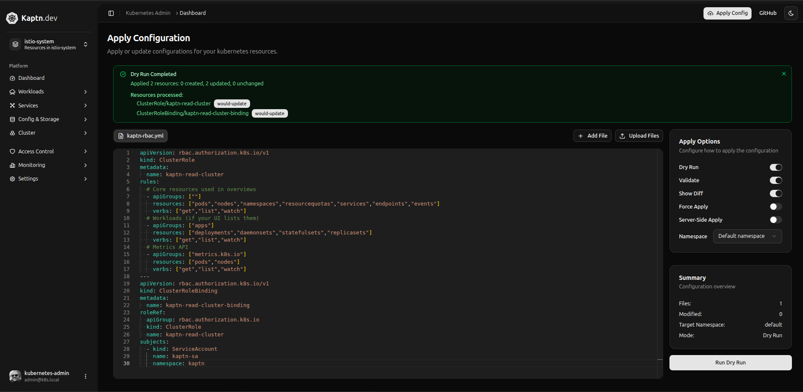
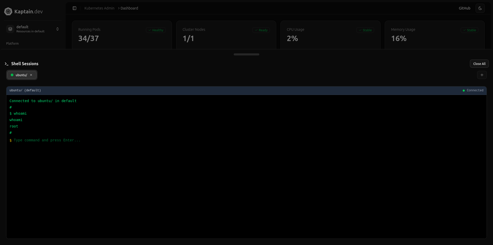
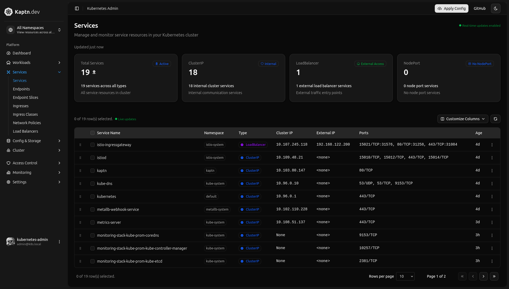

# Kaptain

Kaptn intends to be a secure, production-ready **Kubernetes admin dashboard** that can observe cluster state, track metrics, generate alerts+actions, render opentelemetry traces of web applications for visualizing issues, and perform safe operational actions. Built with Go backend (client-go + WebSockets) and Astro + React + Shadcn frontend (TypeScript + Tailwind CSS).

## Features

- **Real-time cluster monitoring** - Live updates via WebSockets
- **Safe node operations** - Cordon, uncordon, and drain with safeguards
- **Declarative deployments** - Server-side apply with dry-run support
- **Modern UI** - React + TypeScript + Tailwind CSS + ShadCN with dark mode
- **Security-first** - RBAC integration, audit logs, rate limiting
- **Easy deployment** - Helm chart for in-cluster deployment
- **Multiple modes** - Container deployment or desktop app (Wails2)
- **Observability** - Integration with prometheus, grafana, and opentelemetry tracing
- **Istio Service Mesh** - Full support for Istio Service Mesh - VirtualService and Gateways

**Current Dashboard**

Features live updates via kubernetes informer + websockets.


**Edit YAML / Pod Details**

Quick / Detailed views for all resources including ability to quick-edit YAML and perform actions.



**Cloud Shell Exec**


Secure cloudshell to connect to containers/pods via bash or sh.



**Resource Page (Services)**




**Secrets**

Manage/Add/Edit secrets securely (RBAC Enforced access) with the secrets page.


---

## Settings Interface

**API Settings**


**Cluster Settings**


**User Settings**


## Quick Start

There are two ways to provide kaptn with access to your cluster. Either by KUBECONFIG (path added to config.yaml) or `incluster` mode. If deployed either way, you must have the proper cluster admin privileges, whether through KUBECONFIG or through a service account created/used when deploying Kaptn.

### Prerequisites

- Go 1.22+
- Node.js 20+
- Docker (optional)
- K8s cluster (minikube, kind, k3s, doesn't matter)

### Local Development
Kaptn comes with a very useful `Makefile` that performs several useful actions such as:
- `make build` - runs `make frontend` and `make backend` (npm run build on `frontend/` and go build on `internal`)
- `make dev` - builds frontend and backend and launches an npm dev server.
- `make docker` - builds a docker image of Kaptn
- `make docker-debug` - builds a docker image of kaptn with a shell for troubleshooting
- `make push` and `make push-debug` - pushes docker image to registry, although you'll need to put your repo in.

Be sure to checkout the rest of the useful tools like `clean`, `fmt`, `test-go`, etc.

1. **Clone and setup**:
   ```bash
   git clone https://github.com/aaronlmathis/kaptn.git
   cd kaptn
   ```

2. **Edit config.yaml**:
  Edit config.example.yaml and save it as config.yaml. Choose incluster or kubeconfig mode. If deploying incluster, you can create the docker image and use one of the manifests in `deploy/` to get an idea of how to deploy it.

3. **Run the application**:
   ```bash
   make build
   ./bin/server         # Build frontend and backend server.
   
   # Launch server. Web portal and API default to :8080
   ./bin/server
   
   # Available command line options:
   ./bin/server --version           # Show version information
   ./bin/server --health-check      # Perform health check
   ./bin/server --config config.yaml # Use specific config file
   ```

4. **Access the dashboard**:
   - http://localhost:8080/


I will get around to writing better instructions. You should be able to figure out how to deploy it, but if you have problems, email me (aaron@deepthought.sh)

---

## Project Structure
This is probably outdated. But theres a `PROJECT_FILES.md` file that gets updated pretty regularly in root.

```
├── cmd/server/           # Main application entry point
├── internal/             # Private Go packages
│   ├── api/             # HTTP handlers and routing
│   ├── k8s/             # Kubernetes client and operations
│   ├── config/          # Configuration management
│   ├── logging/         # Structured logging
│   └── version/         # Version information
├── frontend/                 # React frontend application
│   ├── src/
│   │   ├── components/  # React components
│   │   └── ...
├── deploy/              # Deployment manifests
│   ├── helm/           # Helm chart
│   └── rbac/           # RBAC examples
├── .github/workflows/   # CI/CD pipelines
└── docs/               # Documentation
```

---

## Configuration

The application can be configured via environment variables or a config file:

```yaml
# config.yaml
server:
  addr: "0.0.0.0:8080"
  base_path: "/"
  cors:
    allow_origins: ["*"]
    allow_methods: ["GET", "POST", "PUT", "DELETE", "OPTIONS"]

security:
  # enable one of: "none", "header", "oidc"
  auth_mode: "none"
  oidc:
    issuer: ""
    client_id: ""
    audience: ""
    jwks_url: ""

kubernetes:
  mode: "kubeconfig"        # or "incluster"
  kubeconfig_path: ""       # used if mode=kubeconfig, defaults to $KUBECONFIG
  namespace_default: "default"

features:
  enable_apply: true
  enable_nodes_actions: true
  enable_overview: true
  enable_prometheus_analytics: true

rate_limits:
  apply_per_minute: 10
  actions_per_minute: 20

logging:
  level: "info"             # debug, info, warn, error

integrations:
  prometheus:
    url: "http://prometheus.monitoring.svc:9090"
    timeout: "5s"
    enabled: true

caching:
  overview_ttl: "2s"
  analytics_ttl: "60s"

jobs:
  persistence_enabled: true
  store_path: "./data/jobs"
  cleanup_interval: "1h"
  max_age: "24h"
```
```
Key environment variables:
- `PORT` - Server port (default: 8080)
- `LOG_LEVEL` - Logging level (debug, info, warn, error)
- `KUBECONFIG` - Path to kubeconfig file
- `KAD_CONFIG_PATH` - Path to config file
```

---

## Development

### Make Targets

```bash
make help           # Show all available targets
make dev            # Run in development mode
make build          # Build binary and frontend
make test           # Run all tests
make lint           # Lint code
make fmt            # Format code
make clean          # Clean build artifacts
make kind-up        # Create Kind cluster
make kind-down      # Delete Kind cluster
make docker          # Without shell
make docker-debug    # build docker image with shell
make push            # Push image to registry
make push-debug      # Push debug image to registry
```

## License

This project is licensed under the GPL 3.0 license - see the [LICENSE](LICENSE) file for details.
